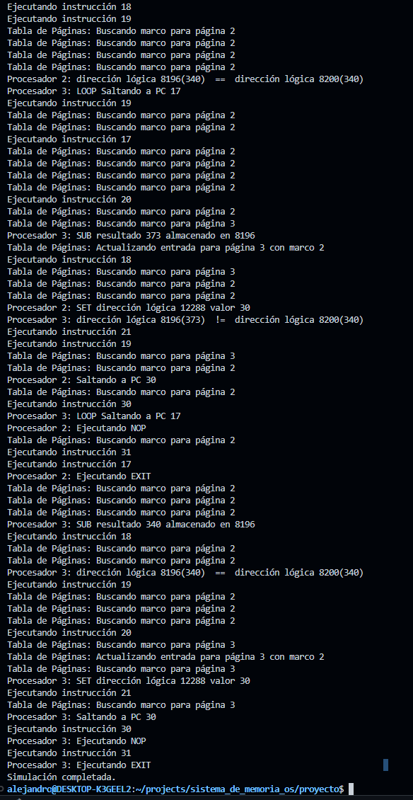

# Sistema de Memoria Virtual para Multiprocesamiento

Estudiantes:

- Alejandro Jiménez - C04079
- Katherine Acosta - B70047

## Descripción del programa

Este proyecto implementa un sistema de memoria virtual multiprocesador en un entorno simulado, con el propósito de comprender y aplicar los conceptos de gestión de memoria en sistemas operativos. El diseño abarca desde la traducción de direcciones lógicas a físicas hasta la resolución de fallos de página, empleando técnicas como tablas de páginas, una unidad de gestión de memoria (MMU) y algoritmos de reemplazo.

La memoria principal está organizada en un esquema de paginación, con marcos y páginas de 4 KB, y una memoria total de 16 MB. La MMU realiza la traducción de direcciones lógicas a físicas y maneja fallos de página utilizando un algoritmo de reemplazo LRU global.

Cada proceso cuenta con su propia tabla de páginas, la cual gestiona el estado de las páginas asignadas, incluyendo la validez, el marco correspondiente, y el tiempo del último acceso. Las instrucciones soportadas incluyen operaciones aritméticas, control de flujo y gestión básica (SET, ADD, SUB, CMP, JMP, LOOP, NOP, EXIT).

Si bien el diseño contemplaba la implementación de una TLB para optimizar las traducciones de direcciones, esta funcionalidad no fue completada debido a limitaciones de tiempo y problemas técnicos.

## Aclaración importante

El proyecto no fue completado en su totalidad debido a problemas de tiempo y diseño. Por lo tanto la representación del sistema de memoria no es correcta del todo, es necesario realizar correcciones. El código quedó aproximadamente completado en un 70% de lo deseado.

## Manual de uso

### Dependencias

El programa esta diseñado para ser ejecutado en un sistema operativo Linux. Idealmente Ubuntu pero debería de ser compatible con cualquiera siempre y que se cuente con el compilador `g++` y las herramientas de desarrollo para `C++` correspondientes.

### Compilación

Desde la terminal navegar hasta la carpeta `proyecto`, utilizando `cd .../proyecto`. Después, para compilar puede usar el siguiente comando:

```bash
make clean; make
```

Esto debería de verse de la siguiente forma:


### Ejecución

Una vez realizada la compilación el programa estará listo para ejecutarse, esto se puede hacer ingresando en la terminal:

```bash
./bin/proyecto <path/al/test.txt> N
```

Donde  "<path/al/test.txt>" es el path al archivo de instrucciones que se le desean cargar al programa. Con este se incluyen los test 1 y 2 realizados. Y N representa la cantidad de procesadores que se desean usar, este no puede ser menor a 1 ni mayor a 4.

Un ejemplo de comando válido de ejecución sería:

``` bash
./bin/proyecto instructions/test2.txt 4
```

Tras esto se debería de ejecutar el programa. La salida esperada para los 2 test incluidos se puede ver a continuación. Para el test 1 se muesta el inicio y para el 2 el final, que no era posible mostrar el test completo en una sola imagen. Se recomienda probar el programa en una terminal aparte y no en una integrada.

#### Test 1


#### Test 2



## Créditos

Makefile hecho por [Jeisson Hidalgo-Céspedes](https://jeisson.ecci.ucr.ac.cr/misc/Makefile).

Copyright 2024: Alejandro Jimenez y Katherine Acosta.
